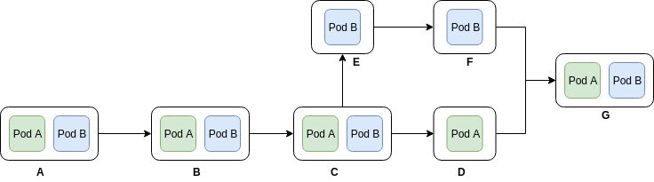

On January 2nd, I joined Srijan Technologies. Bangalore being the technological hub, I decided to join the Srijan Bangalore office. When I moved to Bangalore, I was living close to the office. Hence, I didn’t experience the Bangalore traffic. Until I attended the Kubernetes day which was hosted at the Infosys Company in Electronic city. During my travel from Residency Road to Electronic city, I found how bad the traffic is in Bangalore. Especially in Silk board junction.
 

After I came home I tried to solve the problem hypothetically using the following things I like.
- Kubernetes
- Boring Tunnel by Elon Musk
- Autonomous Vehicle
 

Kubernetes is a software system that allows you to easily deploy and manage containerized applications on top of it.
 

The boring tunnel is an Elon Musk company. He built this company to solve the traffic in LA by using the 3D tunnels and using electronic boards which are able to move the cars at 200mph one place to another. Youtube Video
 

<b>How to solve the problem?</b>
 

We need to build the tunnels under the Bangalore high crowded places. The tunnel will carry the people to their destination using the pods. Pods will be elevated up from the tunnel to the road so that the passengers can onboard the pods. Once the passengers are onboard the pod will be elevated down to the tunnels.
 

<b>Pod</b> — Autonomous Bus: A Kubernetes pod is a group of containers that are deployed together on the same host. In our case, Kubernetes pod will have a single container for a pod. A pod is nothing but an autonomous bus which can carry passengers from one place to another.
 

<b>AutoScaling:</b> In Kubernetes, as the number of requests exceeds the load a pod can handle. Kubernetes will autoscale number pods from 1 to many to handle all the incoming requests. In our case, we can consider the number of passengers in an autonomous bus has a number of requests the pod is experiencing. As the number of passenger increase, the pod can replicate by getting nearby pod where the traffic is low. Or it can take the extra pods from the nearest Hub.
 

<b>Hub</b> is a place where pods come to recharge and also it acts storage for the excess pods. Multiple Hub station can be located in the city. So that when the pod wants to scale up it can take pods from the nearest hub station. And when it wants to scale down it can store the excess pods in the Hub station. Hub can also act as control hubs to monitor all the pods.
 

<b>How a pod will move from source to destination?</b>
Pods can split and merge at a certain point in the route like our trains do. But in our case, it is done autonomously. Hence there will not wait time. Below figure shows one of the scenarios where pod A and B travel together from point A to C. They will split point C and take two paths. Then merge at point G.
 

This solution is not limited to the tunnels. We can use the same solution on the roads too. We can also integrate the solution for roads and tunnels. As the pods can travel both on roads and tunnel.
 

In Bangalore or India, it is difficult to solve the traffic problem by using autonomous technology. If we use the tunnel solution, it will take a lot of money and new technology to build it. And to run autonomous pods on roads it will take strict road rules to be implemented by the government and change mentality of Indian people to not to break rules.
 

I don’t know if we can build the solution. But it’s always good to dream.
 

<b>A dream dreamt today can be reality tomorrow.</b>